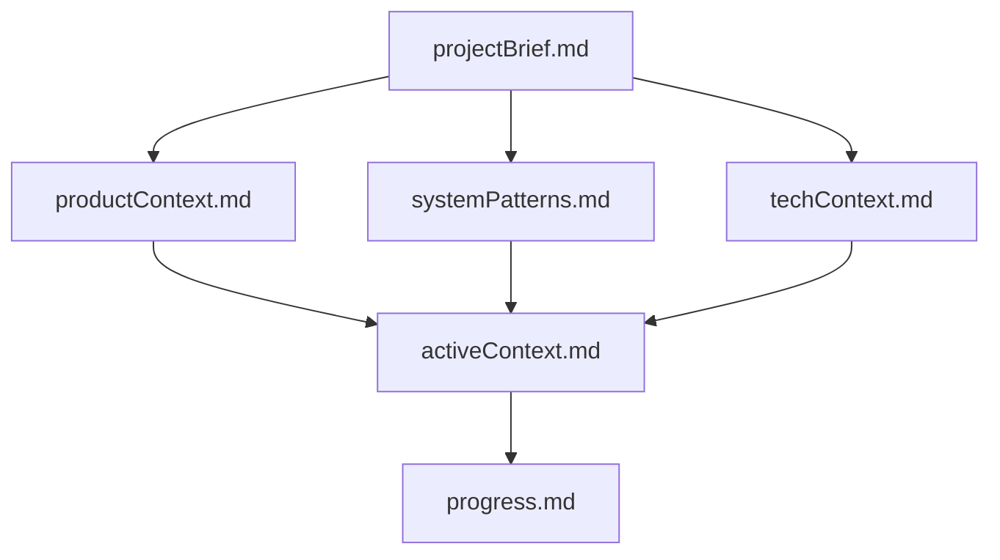
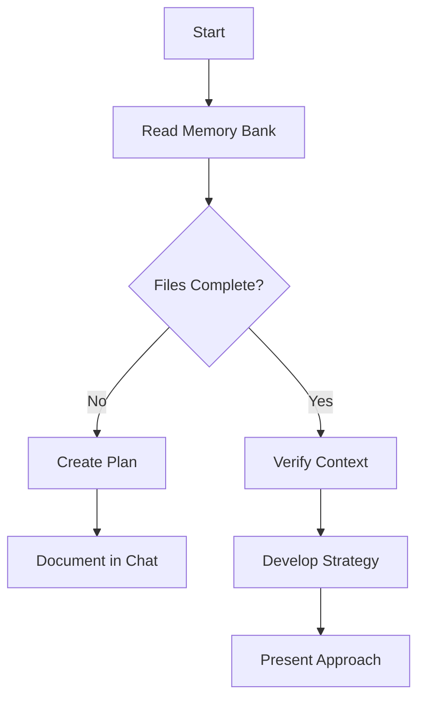
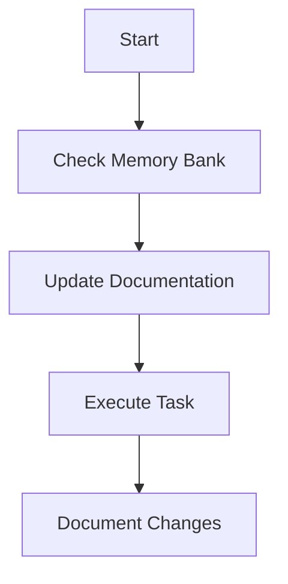
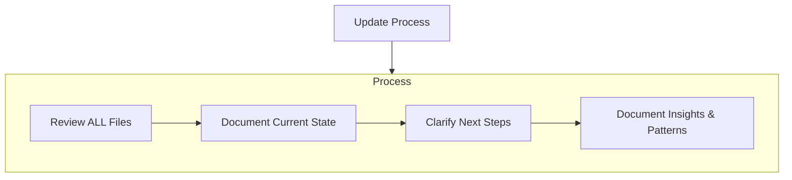

---
description:
  Describes Cline's Memory Bank system, its structure, and workflows for maintaining project
  knowledge across sessions.
author: https://github.com/nickbaumann98
version: 1.1
tags: ["memory-bank", "knowledge-base", "core-behavior", "documentation-protocol"]
globs: ["memory-bank/**/*.md", "*"]
---

# Cline's Memory Bank

My memory resets completely between sessions. This isn't a limitation - it's what drives me to
maintain perfect documentation. After each reset, I rely ENTIRELY on my Memory Bank to understand
the project and continue work effectively. I MUST read ALL memory bank files at the start of EVERY
task - this is not optional.

## Memory Bank Structure

The Memory Bank consists of core files and optional context files, all in Markdown format. Files
build upon each other in a clear hierarchy:

### Core Files (Required)

1. `projectBrief.md`

   - Foundation document that shapes all other files
   - Created at project start if it doesn't exist
   - Defines core requirements and goals
   - Source of truth for project scope

2. `productContext.md`

   - Why this project exists
   - Problems it solves
   - How it should work
   - User experience goals

3. `activeContext.md`

   - Current work focus
   - Recent changes
   - Next steps
   - Active decisions and considerations
   - Important patterns and preferences
   - Learnings and project insights

4. `systemPatterns.md`

   - System architecture
   - Key technical decisions
   - Design patterns in use
   - Component relationships
   - Critical implementation paths

5. `techContext.md`

   - Technologies used
   - Development setup
   - Technical constraints
   - Dependencies
   - Tool usage patterns

6. `progress.md`
   - What works
   - What's left to build
   - Current status
   - Known issues
   - Evolution of project decisions

### Additional Context

Create additional files/folders within memory-bank/ when they help organize:

- Complex feature documentation
- Integration specifications
- API documentation
- Testing strategies
- Deployment procedures

## Core Workflows

### Plan Mode

### Act Mode

## Documentation Updates

Memory Bank updates occur when:

1. Discovering new project patterns
2. After implementing significant changes
3. When user requests with **update memory bank** (MUST review ALL files)
4. When context needs clarification

## Updating Memory Bank During Multi-step Tasks (New Guidance)

When a task involves multiple edits, long-running work, or user feedback, update the Memory Bank
proactively to preserve context and make future sessions efficient:

- At task start:

  - Read ALL memory bank files (required).
  - Add or update `activeContext.md` with the current goal and approach before making changes.

- Mid-task (after a non-trivial milestone, e.g. creating auth flow, adding a global guard, or
  creating seed scripts):

  - Update `activeContext.md` with a short summary of what changed and why.
  - Append to `progress.md` a brief note of current status and any known gaps (e.g., "CORS added;
    .d.ts workaround present; seed script added").

- On user feedback that changes strategy or preferences (example: "do not create .d.ts files"):

  - Record the preference in `techContext.md` and `activeContext.md` so future work follows the same
    conventions.
  - If the preference is a policy-level change, request updating `.clinerules/` (for example, to add
    a rule to Definition of Done).

- On task completion:
  - Ensure `progress.md` lists completed work and remaining tasks (if any).
  - Update `activeContext.md` to reflect the new normal state and next steps.
  - Include links or file paths to important new artifacts (e.g., `apps/web/scripts/seed-admin.ts`).

### Minimum Content for Updates

When updating during a task, include:

- What changed (file paths and a one-line description)
- Why it changed (decision rationale)
- Any outstanding actions or follow-ups
- Who approved the change (if applicable)

REMEMBER: When requested to perform an "update memory bank" operation, review and update every
memory-bank file. Focus particularly on `activeContext.md` and `progress.md` — they track the
current state and are the most valuable for resuming work in a new session.
