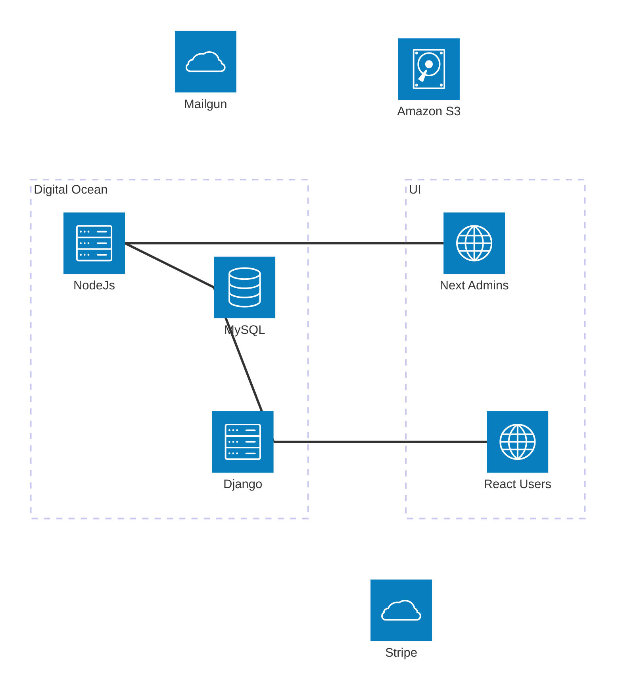

# BHMC Admin

Administrative interface for golf tournament management, designed to complement the [BHMC React frontend](https://github.com/finleysg/bhmc) and [Django backend](https://github.com/finleysg/bhmc-api). This monorepo implements the admin service and admins service in the following diagram:



## Features

- **Tournament Management:** Full event lifecycle, tee time calculations, group assignments, hole-based starts
- **Player Registration:** Automated slots, fee tracking, Golf Genius sync
- **Golf Genius Integration:** Bidirectional sync for events, rosters, scores, and results
- **Scoring & Results:** Scorecard management, automated results import, multi-format reporting
- **Admin Dashboard:** Authenticated interface for all tournament operations, audit logging
- **Reporting & Analytics:** Tournament reports, player stats, Excel export

## Tech Stack

- Node.js 20+, pnpm@10+, TurboRepo
- **API:** NestJS, Drizzle ORM (MySQL, containerized via Docker), Zod, Axios, RxJS, ExcelJS
- **Web:** Next.js (App Router, TypeScript), better-auth, Tailwind CSS v4, daisyUI 5, @tanstack/react-table
- **Shared Types:** TypeScript domain package for DTOs and interfaces
- **Testing:** Jest, ESLint, Prettier (zero errors)

## Setup

```sh
pnpm install
pnpm docker:up        # Start MySQL/SQLite containers
pnpm dev              # Run both apps (API & Web)
pnpm lint             # Lint all code
pnpm test             # Run all tests
```

- API: `apps/api` (NestJS, MySQL)
- Admin: `apps/admin` (Next.js, SQLite for auth)

## Usage

- API health: `GET /health`
- Web health: `GET /health`
- Auth: better-auth (see `.env.example` in each app)
- Reports: Excel export via admin dashboard

## Development Notes

- Strict TypeScript, no `any` types in production
- Domain-driven design, shared DTOs/interfaces
- Module boundaries enforced via barrel exports
- ESLint/Prettier: zero errors, consistent formatting
- Dockerized databases for dev parity

## Infrastructure (DigitalOcean)

**Current:** 2 vCPU / 1.9 GiB ($21/mo) — plan to scale to 4 GiB ($24/mo) for the 2026 season.

### Services Running

| Container                  | ~Memory | Notes                                         |
| -------------------------- | ------- | --------------------------------------------- |
| bhmc-next (Next.js public) | 385 MiB | Largest consumer, shows gradual memory growth |
| bhmc-backend (Django)      | 247 MiB | Gunicorn with 5 workers                       |
| bhmc-api (NestJS)          | 134 MiB |                                               |
| CapRover                   | 106 MiB |                                               |
| bhmc-admin (Next.js)       | 75 MiB  |                                               |
| nginx                      | 46 MiB  |                                               |

### Nginx Tuning (CapRover Base Config)

Applied via CapRover Settings > Nginx Configurations > Base Configuration:

| Setting                | Default | Tuned         | Why                                                          |
| ---------------------- | ------- | ------------- | ------------------------------------------------------------ |
| `worker_processes`     | `1`     | `auto`        | Use both vCPUs                                               |
| `worker_rlimit_nofile` | not set | `4096`        | Ensure file descriptors aren't a bottleneck                  |
| `worker_connections`   | `1024`  | `2048`        | 4096 total connections (2 workers x 2048)                    |
| `gzip`                 | `off`   | `on` (global) | Compress responses for all apps, not just CapRover dashboard |

### Season Prep Checklist

- [ ] Resize to 4 GiB / 2 vCPU droplet
- [ ] Apply nginx base config tuning (see table above)
- [ ] Set Docker memory limit on bhmc-next (512 MiB) via CapRover to auto-restart on leak
- [ ] Run `docker system prune -a` to reclaim disk before the season
- [ ] Confirm 1 GiB swap file is active (`free -h`)
- [ ] Scale back down at end of season

## Related Projects

- [BHMC React frontend](https://github.com/finleysg/bhmc)
- [BHMC Django backend](https://github.com/finleysg/bhmc-api)
- [daisyUI documentation](https://daisyui.com/docs/)
