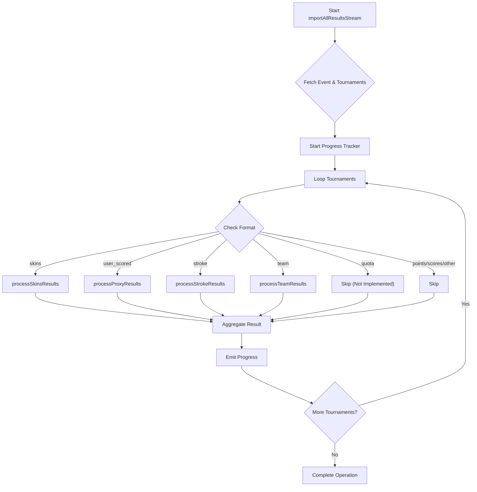

# Import All Results

```mermaid
flowchart TD
    A["Start importAllResultsStream"] --> B{"Fetch Event & Tournaments"}
    B --> C["Start Progress Tracker"]
    C --> D["Loop Tournaments"]
    D --> E{"Check Format"}

    E -- "skins" --> F["processSkinsResults"]
    E -- "user_scored" --> G["processProxyResults"]
    E -- "stroke" --> H["processStrokeResults"]
    E -- "team" --> I["processTeamResults"]
    E -- "quota" --> J["Skip (Not Implemented)"]
    E -- "points/scores/other" --> K["Skip"]

    F --> L["Aggregate Result"]
    G --> L
    H --> L
    I --> L
    J --> L
    K --> L

    L --> M["Emit Progress"]
    M --> N{"More Tournaments?"}
    N -- "Yes" --> D
    N -- "No" --> O["Complete Operation"]
```
