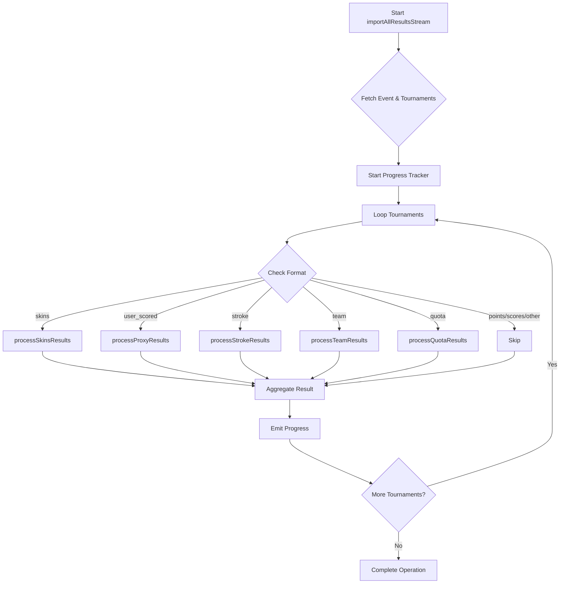

# Import All Results

## Supported Tournament Formats

### Quota Tournaments
Quota tournaments involve players competing against a preset quota or handicap-adjusted target score. Results import:

- **Position**: Player's finishing position
- **Score**: The quota result (e.g., "+2", "-1", "0") representing strokes over/under quota
- **Purse**: Money awarded based on performance
- **Summary**: Formatted as "Quota score: [score]" for display

Supports standard tournament result fields: position, score, amount, etc., with quota-specific score handling in the summary field.
