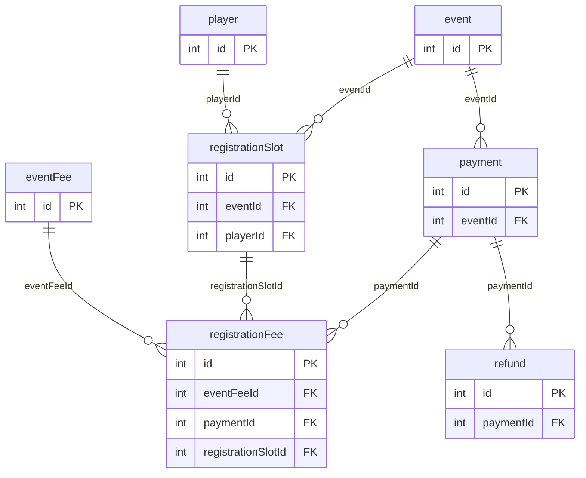

# Payments

Payment relationships for the finance report.

```mermaid
erDiagram
    event {
        int id PK
    }
    eventFee {
        int id PK
    }
    payment {
        int id PK
        int eventId FK
    }
    refund {
        int id PK
        int paymentId FK
    }
    player {
        int id PK
    }
    registrationFee {
        int id PK
        int eventFeeId FK
        int paymentId FK
        int registrationSlotId FK
    }
    registrationSlot {
        int id PK
        int eventId FK
        int playerId FK
    }

    event ||--o{ payment : "eventId"
    event ||--o{ registrationSlot : "eventId"

    eventFee ||--o{ registrationFee : "eventFeeId"

    payment ||--o{ refund : "paymentId"
    payment ||--o{ registrationFee : "paymentId"

    player ||--o{ registrationSlot : "playerId"

    registrationSlot ||--o{ registrationFee : "registrationSlotId"
```
