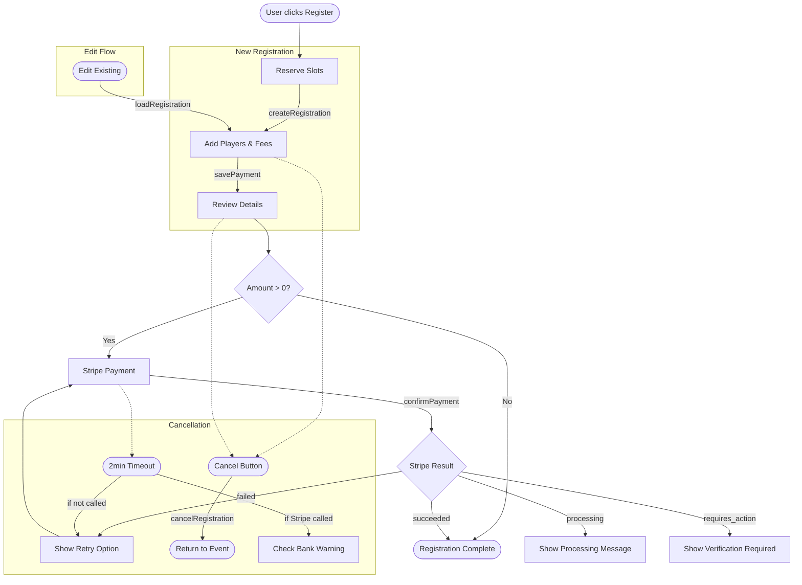
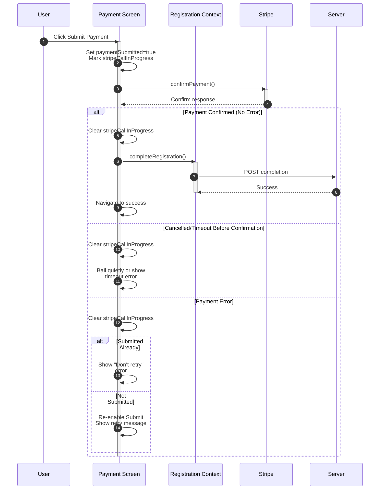

# Event Registration & Payment Flow

This document describes the user-facing event registration and payment process. Admin processes are excluded.

## User Journey

```
Reserve → Register → Review → Payment → Complete
```



### Step 1: Reserve Tee Time (`/event/:date/:name/reserve`)
- User views available course/hole combinations
- Selects slots to reserve
- `createRegistration()` creates registration on backend
- Navigates to Register step

### Step 2: Register Players & Fees (`/event/:date/:name/register`)
- Add players to slots via people picker
- Select optional fees (skins, etc.) per player
- Add notes/special requests
- `savePayment()` persists payment details
- Navigates to Review step

### Step 3: Review (`/event/:date/:name/review`)
- Read-only confirmation of players, fees, amount due
- If amount > 0: proceed to payment
- If amount = 0: complete registration immediately

### Step 4: Payment (`/event/:date/:name/:paymentId/payment`)
- Stripe PaymentElement form
- `createPaymentIntent()` → Stripe `confirmPayment()`
- 2-minute timeout guard for stuck payments
- Success → Complete screen

### Step 5: Complete (`/event/:date/:name/:paymentId/complete`)
- Retrieves PaymentIntent status from Stripe
- Displays success/failure/processing message
- Links to event or home

### Edit Flow
- Loads existing registration via `loadRegistration()`
- Mode = "edit" (no countdown timer)
- Same Register → Review → Payment flow

---

## Key Files

### Screens (`src/screens/registration/`)
| File | Purpose |
|------|---------|
| `reserve.tsx` | Reserve tee time/holes |
| `register.tsx` | Add players, fees, notes |
| `edit-registration.tsx` | Modify existing registration |
| `review-registration.tsx` | Confirm details before payment |
| `payment-flow.tsx` | Stripe Elements wrapper |
| `payment.tsx` | Stripe payment form |
| `registration-complete.tsx` | Payment status & completion |
| `event-detail.tsx` | Entry point, route orchestrator |

### Components (`src/components/event-registration/`)
| File | Purpose |
|------|---------|
| `registration-slot-group.tsx` | Container for all slots |
| `registration-slot-line-item.tsx` | Single slot with player/fees |
| `registration-slot-line-item-review.tsx` | Read-only slot view |
| `registration-slot-player.tsx` | Player selection UI |
| `event-fee-checkbox.tsx` | Fee toggle UI |
| `registration-amount-due.tsx` | Cost summary |
| `register-countdown.tsx` | Timer (new mode only) |
| `cancel-button.tsx` | Cancellation with dialog |

### Context (`src/context/`)
| File | Purpose |
|------|---------|
| `registration-context-provider.tsx` | Main provider with mutations |
| `registration-context.tsx` | Context interface |
| `registration-reducer.ts` | Immer-based state reducer |

---

## State Management

### Context Shape
```typescript
{
  clubEvent: ClubEvent | null
  correlationId: string              // Tracks related requests
  currentStep: IRegistrationStep
  error: Error | null
  existingFees: Map<string, RegistrationFee> | null
  mode: "new" | "edit" | "idle"
  payment: Payment | null
  registration: Registration | null
  stripeClientSession?: string
}
```

### Registration Modes
- `idle` - No registration in progress
- `new` - Creating new registration (countdown timer active)
- `edit` - Modifying existing (no countdown)

### Step Progression
1. `PendingStep` (0) - Initial
2. `ReserveStep` (1) - Selecting slots
3. `RegisterStep` (2) - Adding players/fees
4. `ReviewStep` (3) - Confirmation
5. `PaymentStep` (4) - Stripe payment
6. `CompleteStep` (5) - Success

### Key Reducer Actions
- `create-registration` - New registration created
- `load-registration` - Existing loaded (edit mode)
- `add-player` / `remove-player` - Slot assignment
- `add-fee` / `remove-fee` - Fee management
- `update-payment` - Payment record updated
- `cancel-registration` - Reset to idle
- `complete-registration` - Finish and clear

---

## API Endpoints

All requests include `X-Correlation-ID` header.

### Registration
| Method | Endpoint | Purpose |
|--------|----------|---------|
| POST | `/registration` | Create registration |
| GET | `/registration?event_id=X&player_id=Y` | Load existing |
| PATCH | `/registration/{id}` | Update notes |
| PUT | `/registration/{id}/cancel` | Cancel |
| PUT | `/registration/{id}/add-players` | Add players |

### Slots
| Method | Endpoint | Purpose |
|--------|----------|---------|
| PATCH | `/registration/slots/{slotId}` | Assign/remove player |

### Payments
| Method | Endpoint | Purpose |
|--------|----------|---------|
| POST | `/payments` | Create payment record |
| PUT | `/payments/{id}` | Update payment |
| POST | `/payments/{id}/payment-intent` | Create Stripe PaymentIntent |
| GET | `/payments/{id}/stripe-amount` | Get calculated amount |
| POST | `/payments/customer-session` | Stripe CustomerSession |

---

## Payment Flow



### Fee Calculation
```
transactionFee = 2.9% + $0.30

subtotal = sum of fees
total = (subtotal + 0.30) / (1.0 - 0.029)

Example: $100 registration
  subtotal: $100.00
  total: $103.30
  transactionFee: $3.30
```

### Stripe Integration
1. **Setup**: `Elements` wrapper with customer session (enables saved cards)
2. **Validate**: `elements.submit()` validates form
3. **Create Intent**: `POST /payments/{id}/payment-intent`
4. **Confirm**: `stripe.confirmPayment()` with return URL
5. **Complete**: Retrieve intent status on complete screen

### Intent Statuses
- `succeeded` - Payment complete
- `processing` - Bank processing
- `requires_action` - 3D Secure verification needed
- `requires_payment_method` - Payment failed, retry needed

---

## Guards & Edge Cases

### Registration Guard (`useEventRegistrationGuard`)
- Runs on routes requiring active registration
- Redirects to event if `registration?.id` is falsy

### Priority Registration
- During priority window: requires `minimumSignupGroupSize` players
- Violation shows "Large Groups Only" dialog

### Slot Conflict
- If slots taken: invalidates query, forces refresh
- User must select different slots

### Payment Timeout (2 minutes)
- If Stripe was called: warns user to check bank before retry
- If Stripe not called: safe to retry immediately

### Navigation Guard
- `useBlocker` prevents leaving during payment
- User can force-cancel with warning

### Countdown Timer (new mode only)
- Counts down from `registration.expires`
- At 0: triggers `cancelRegistration("timeout")`

### Cancellation
- `new` mode: calls `cancelRegistration()` to clear server state
- `edit` mode: just navigates away
- Reason codes: `user`, `timeout`, `navigation`, `violation`

---

## Data Models

### Registration
```typescript
class Registration {
  id: number
  eventId: number
  courseId?: number
  signedUpBy: string        // User email
  expires: Date             // Session expiry
  notes?: string
  selectedStart?: string    // Display: "Event: Course Group"
  slots: RegistrationSlot[]
}
```

### RegistrationSlot
```typescript
class RegistrationSlot {
  id: number
  registrationId: number
  playerId: number          // 0 if empty
  playerName?: string
  startingOrder: number
  slot: number              // Team position
  status: string
  fees: RegistrationFee[]
}
```

### Payment
```typescript
class Payment {
  id: number
  eventId: number
  paymentCode: string
  paymentAmount: number     // Subtotal
  transactionFee: number
  confirmed: boolean
  details: PaymentDetail[]
}
```

### PaymentDetail
```typescript
class PaymentDetail {
  id: number
  eventFeeId: number
  slotId?: number
  amount: number
  isPaid: boolean
}
```

### EventFee
```typescript
class EventFee {
  id: number
  eventId: number
  name: string              // "Green Fee", "Skins"
  amount: number
  isRequired: boolean
  overrideAmount?: number   // For restricted pricing
  overrideRestriction?: string
}
```

---

## Route Structure

```
/event/:eventDate/:eventName
  ├── (index)                    → Event view
  ├── /reserve                   → Reserve slots
  ├── /register                  → Add players/fees
  ├── /edit                      → Edit existing
  ├── /review                    → Confirm details
  ├── /:paymentId/payment        → Payment wrapper
  │   ├── /payment               → Stripe form
  │   └── /complete              → Status screen
  └── /registrations             → View all registered
```
